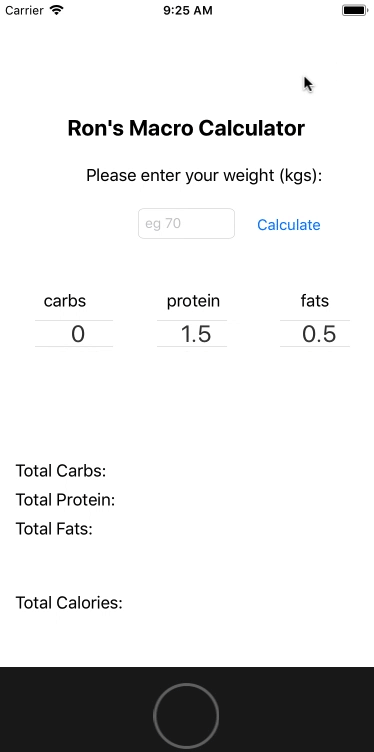

# iOS Food Macro Calculator

Calculates macronutrients (fats,protein & carbs) based on weight entered.

Select ratios based on desired goal:

```
Calorie deficit (lose weight) - decrease carb ratio.
Calorie surplus (gain weight) - increase carb ratio & or protein ratio.
  
  
```  


## Purpose

Initially created as an easy way to calculate my own macronutrient intake.
Sharing this code to help beginners, personally found the UIPickerView a-bit
confusing at first. The swift code is heavily commented to help you understand
my thought process based on my own research.


### Prerequisites


```
Language: Swift / iOS
OS: macOS

```

## Versioning

1.0

## Authors

* **Ron Nair** - [RonNair24](https://github.com/RonNair24)

## References

* https://www.jimstoppani.com/home/featured-meal-plans/dieting-101
